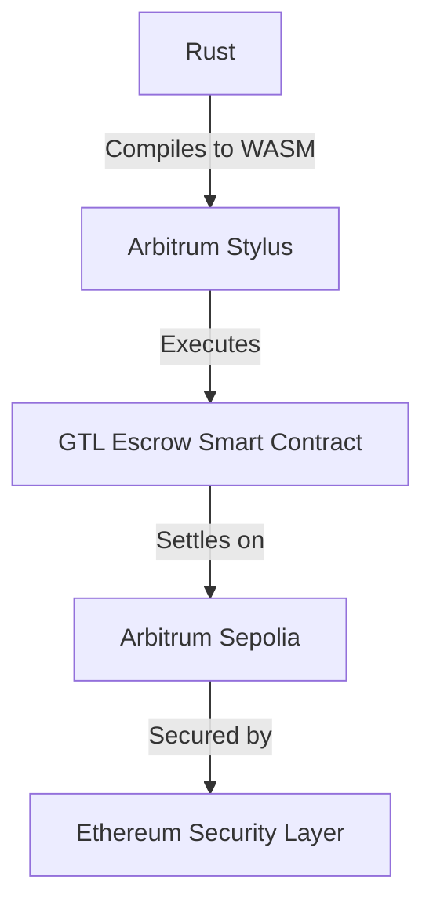
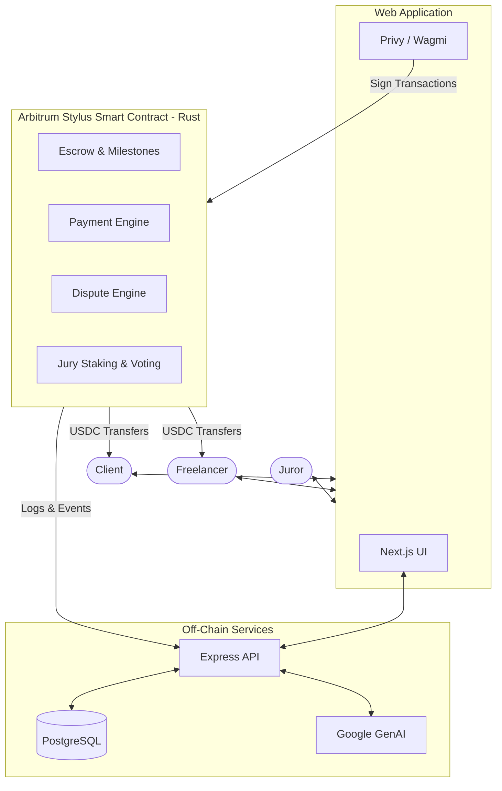
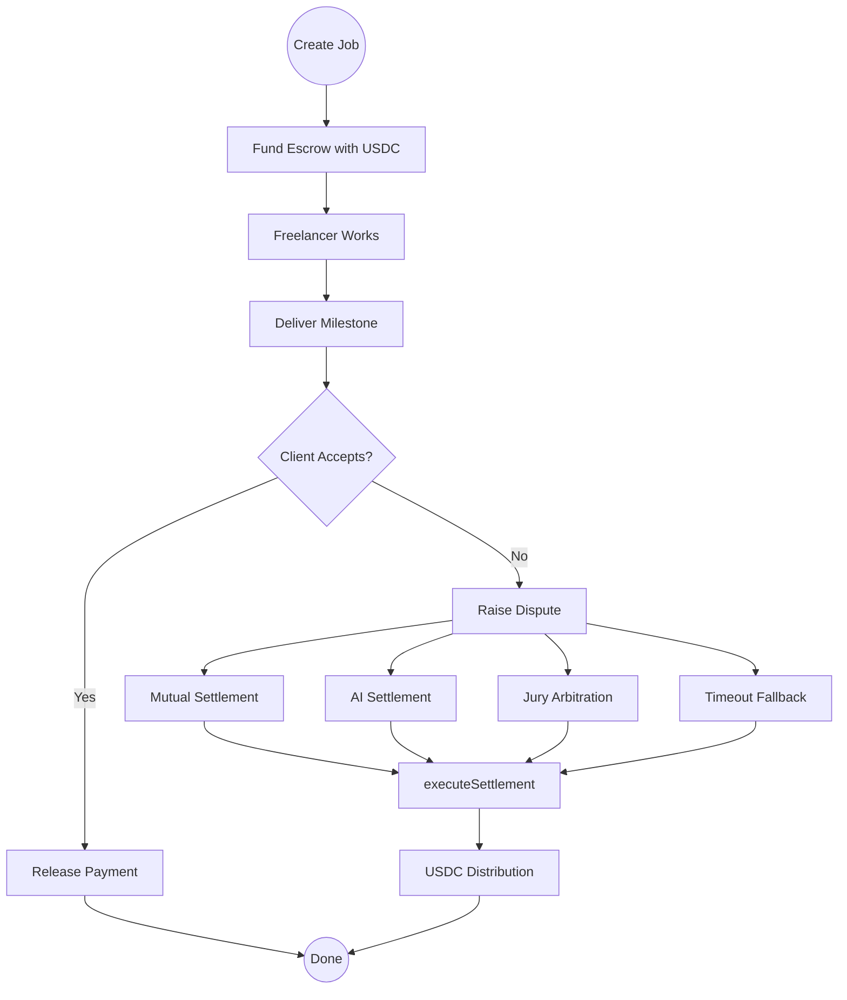

# 🌐 Global Trust Layer (GTL)
## Decentralized Escrow & Dispute Resolution for Freelancing

Work should not require blind trust. GTL turns trust into verifiable protocol rules.


[Live Demo](#) | [Documentation](#) | [Smart Contract](#) | [Demo Video](#)

---

## 🛑 The Problem

Freelancing introduces an inherent trust dilemma:
- **Clients** worry about paying before receiving acceptable work.
- **Freelancers** worry about completing work without receiving payment.

Centralized platforms (like Upwork or Fiverr) solve this by acting as the ultimate trusted intermediary. However, this model means **centralized platforms control escrow, dispute decisions, and charge massive fees** (often up to 20%). Dispute resolution is opaque, slow, and completely platform-dependent.

**GTL moves the trust-critical parts of this relationship from platform promises to verifiable protocol rules.**

---

## 💡 The Solution

The **Global Trust Layer (GTL)** is a decentralized, milestone-based escrow protocol where smart contracts control funds and enforce predefined settlement rules.

1. **Create & Fund**: A client creates a job and funds the escrow using **USDC**.
2. **Work & Deliver**: The freelancer completes milestones and submits cryptographic delivery proofs.
3. **Release**: The client releases payment upon satisfaction.
4. **Dispute**: If a dispute occurs, the protocol provides multiple robust resolution paths, including **Mutual Settlement**, **AI-Assisted Settlement**, and **Jury Arbitration**.

**The smart contract is the trust layer.**

---

## 🔗 Why Blockchain?

| Traditional Platform | GTL |
|:---|:---|
| Centralized escrow | Smart-contract escrow |
| Platform-controlled rules | Protocol-enforced rules |
| Opaque dispute process | Verifiable dispute state |
| Centralized payment control | On-chain settlement |
| Platform-dependent trust | Cryptographically verifiable state |

GTL intentionally keeps only trust-critical state on-chain, ensuring verifiable interactions while large application data remains off-chain:
- **Escrow & Payment State**
- **Milestone & Dispute State**
- **Settlement & Voting State**
- **Hashes/References** (e.g., IPFS delivery hashes)

---

## 🚀 Why Arbitrum?

GTL requires a low-cost, high-throughput environment without sacrificing Ethereum's security.

**Arbitrum** is a Layer-2 blockchain providing an Ethereum-aligned execution environment with vastly lower transaction costs.
**Arbitrum Stylus** allows our core escrow smart contracts to be written in **Rust**. Rust provides incredibly strong type and memory safety characteristics, which are absolutely essential for a trust-critical escrow protocol managing user funds.



*GTL is currently deployed and active on Arbitrum Sepolia.*

---

## 🏗️ System Architecture



### Hybrid Architecture
- **On-chain**: Trust-critical state (Job status, USDC escrow, dispute settlement rules, voting commitments).
- **Off-chain**: Heavy application metadata, job descriptions, UI indexing, and detailed AI analysis reports (with only the resulting hash and confidence scores posted on-chain).

---

## 🔄 Core Workflow



---

## ⚖️ Dispute Resolution Engine

GTL implements four robust, distinct dispute resolution mechanisms embedded natively in the protocol.

### 1. Mutual Settlement
The client proposes a percentage split (e.g., Client: 70%, Freelancer: 30%). If the freelancer accepts, the smart contract immediately executes the settlement.

### 2. AI-Assisted Settlement
An off-chain AI oracle (Google Gemini) analyzes the job requirements and delivered work, generating an unbiased report. The oracle submits a cryptographically verifiable **report hash**, a **confidence score**, and a **suggested settlement split** directly to the smart contract.

### 3. Jury Arbitration
If AI/Mutual settlements fail, the dispute is escalated to a decentralized jury.
- **Registration**: Jurors register and stake GTL tokens.
- **Commit-Reveal Voting**: Jurors securely commit a hidden vote hash, and later reveal their proposed split with a cryptographic salt to prevent vote-copying.
- **Settlement**: The majority vote determines the final split. 
*(Note: Automated juror selection is planned; current assignment relies on admin/manual routing for testing).*

### 4. Timeout Settlement
If the dispute deadline expires without a resolution, the protocol executes a fallback timeout settlement (e.g., a 50/50 split) to ensure funds never get permanently locked.

---

## 🦀 Smart Contract Architecture

The core of GTL is a robust Rust codebase leveraging the Arbitrum Stylus SDK.

| Module | Responsibility |
| :--- | :--- |
| `escrow/` | Job creation, USDC funding, milestone delivery, and release |
| `dispute/` | Dispute lifecycle, AI settlement, mutual settlement, and timeouts |
| `payment/` | Shared payment/settlement engine |
| `juror/` | Juror registration, staking, and commit-reveal voting |
| `token/` | GTL token functionality |
| `storage/` | Persistent protocol state definitions |
| `events.rs` | Blockchain events (e.g., `JobCreated`, `DisputeRaised`) |
| `errors.rs` | Custom Solidity errors for safe reverting |
| `lib.rs` | Contract entry point |

### The Payment Engine
GTL centralizes all fund distributions into a shared `executeSettlement()` payment engine. Instead of writing separate transfer logic for every resolution mechanism, they all load the dispute state, calculate shares, and invoke the shared payment engine. This drastically reduces the attack surface and ensures all resolutions safely transfer USDC.

---

## 🛡️ Security Model

Trust is meaningless without security. The GTL smart contract rigorously validates all state transitions.

**Implemented Security Features:**
- ✅ **Strict Authorization**: Only authorized parties can interact with their specific jobs/milestones.
- ✅ **Double-Release Prevention**: State variables track delivery and release to prevent reentrancy or double spends.
- ✅ **Commit-Reveal Voting**: Cryptographic salts prevent jurors from front-running or copying votes.
- ✅ **Empty Hash Protection**: Reverts on `bytes32(0)` submissions.
- ✅ **Custom Errors**: No Rust panics. All validation failures safely return custom Solidity `EscrowError` variants.

---

## 💻 Tech Stack

| Layer | Technology | Purpose |
| :--- | :--- | :--- |
| **Blockchain** | Arbitrum Sepolia | High-speed, low-cost execution layer |
| **Smart Contracts** | Rust + Arbitrum Stylus | Trust-critical escrow protocol |
| **Payments** | USDC (ERC-20) | Stablecoin escrow funding |
| **Frontend** | Next.js, Tailwind, React | Client/Freelancer web interface |
| **Web3 Integration** | Wagmi, Viem, Privy | Wallet connection & transaction signing |
| **Backend** | Node.js, Express | Application services & AI oracle bridging |
| **Database** | PostgreSQL | Off-chain application data |
| **AI Oracle** | Google Generative AI | AI-assisted dispute analysis |

---

## ✨ Key Features

| Feature | Status |
| :--- | :--- |
| 🔐 Smart-contract escrow | ✅ Implemented |
| 💵 USDC funding | ✅ Implemented |
| 📦 Milestone-based payments | ✅ Implemented |
| 📤 Cryptographic delivery hashes | ✅ Implemented |
| ⚖️ Multi-path dispute resolution | ✅ Implemented |
| 🤖 AI-assisted settlement | ✅ Implemented |
| 👥 Jury arbitration (Commit-Reveal) | ✅ Implemented |
| ⏱️ Timeout resolution | ✅ Implemented |
| 🪙 GTL Staking | ✅ Implemented |
| 🛡️ Contract validation & custom errors | ✅ Implemented |

---

## 💱 ERC-20 / USDC Flow

The protocol interacts seamlessly with USDC for predictable escrow value:

```text
Client Wallet
     │
     │ 1. approve(Escrow, amount)
     ▼
USDC Contract
     │
     │ 2. fundJob() triggers transferFrom()
     ▼
GTL Escrow Contract
     │
     │ 3. releaseMilestone() or executeSettlement() triggers transfer()
     ▼
Client / Freelancer
```

---

## 🌐 On-Chain vs Off-Chain

| On-Chain (Arbitrum Stylus) | Off-Chain (PostgreSQL) |
| :--- | :--- |
| Job & Milestone state | Detailed Job Descriptions & UI Metadata |
| Escrow & Payment balances | Large delivery files / evidence |
| Dispute & Settlement rules | Detailed AI analysis reports |
| Juror staking & Voting hashes | Application-level analytics |

**Why this matters:** This hybrid architecture guarantees cryptographic security and verifiability while maintaining web2-level speed and storage efficiency.

---

## 📍 Testnet Deployment

GTL is currently deployed and functional on the **Arbitrum Sepolia** testnet.

- **Escrow Contract**: `0xE84AA9731F100A068F09F50FB606B28C9A69B1A3`
- **USDC (Mock)**: `0xD453DF7A01aef0a52589b492d222Edf8EEdAd897`
- **Reputation Registry**: `0x40c6b2ccb51012adb50e70efdc5d1d35223f5421`

---

## 🏆 Why GTL Matters (Hackathon Value Proposition)

GTL isn't just another freelance app—it is a **reusable trust layer**.
Centralized platforms extract massive fees simply because they act as the trusted middleman. GTL replaces the middleman with smart contract rules.

1. **Escrow is Programmable**: Funds are governed entirely by code.
2. **Disputes are Native**: Dispute resolution isn't an external customer-support process; it's embedded natively in the smart contract workflow.
3. **AI + Blockchain Synergy**: AI provides unbiased, intelligent analysis while the blockchain enforces the final settlement rules.
4. **Built on Arbitrum Stylus**: Harnessing the performance and memory safety of Rust for a highly secure financial protocol.

---

## 🏁 Getting Started

### Prerequisites
- Node.js (v18+)
- Rust & Cargo
- `cargo-stylus` CLI
- Arbitrum Sepolia Testnet ETH & Mock USDC

### 1. Clone the Repository
```bash
git clone https://github.com/Shravani-Sawant28/Global_Trust_Layer.git
cd Global_Trust_Layer
```

### 2. Frontend Setup
```bash
cd frontend
npm install
# Set up your .env.local with Privy/RPC keys
npm run dev
```

### 3. Backend Setup
```bash
cd backend
npm install
# Set up your .env with PostgreSQL and Google Gemini API keys
npm start
```

### 4. Smart Contract Development
```bash
cd gtl-escrow
cargo stylus check
cargo stylus deploy --private-key-path <PATH> --endpoint https://sepolia-rollup.arbitrum.io/rpc
```

---

